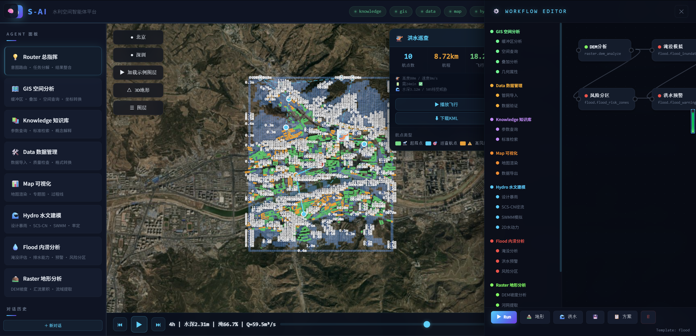
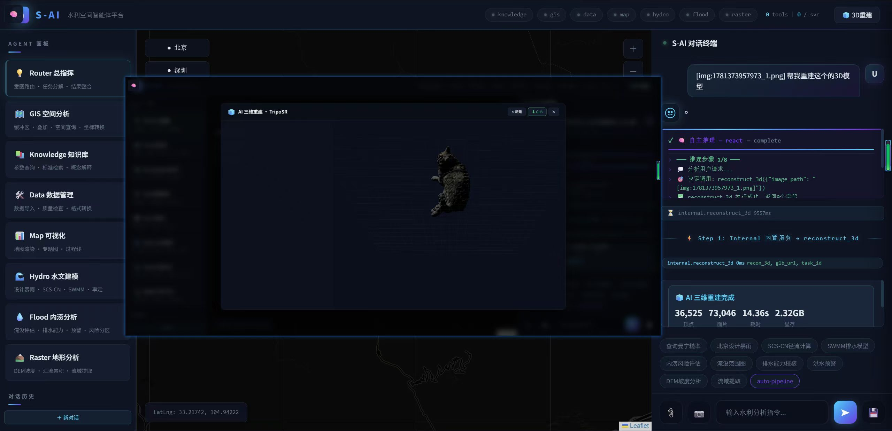
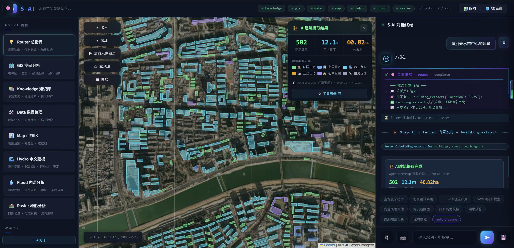
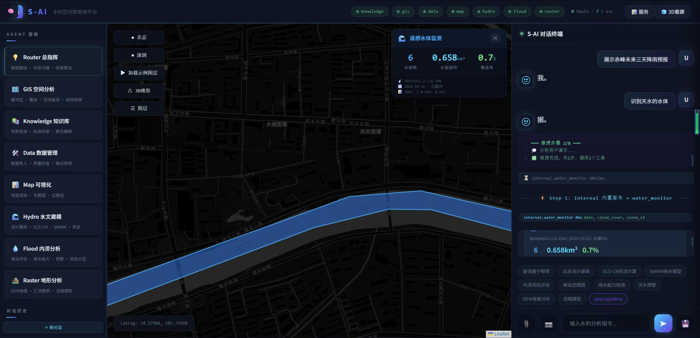
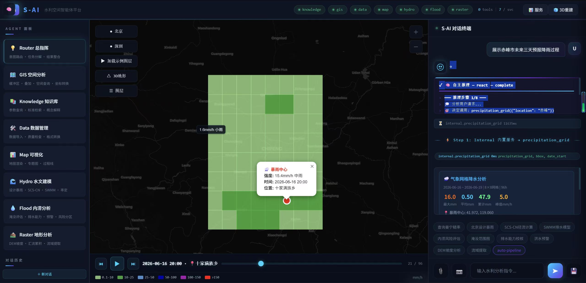
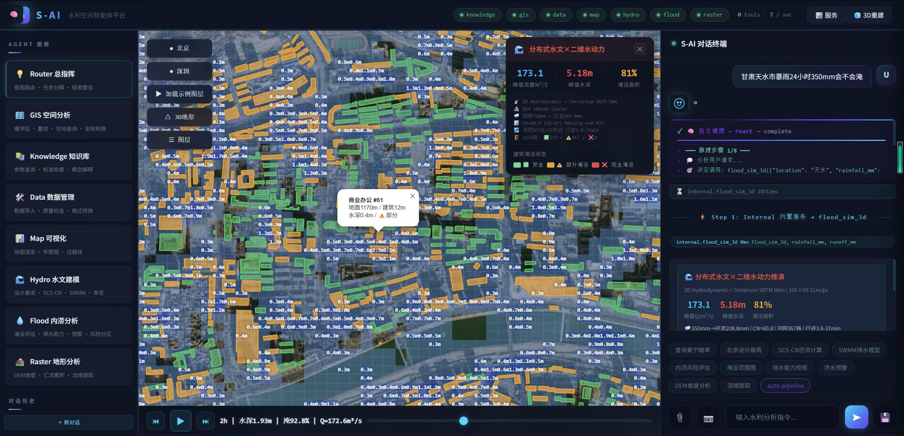
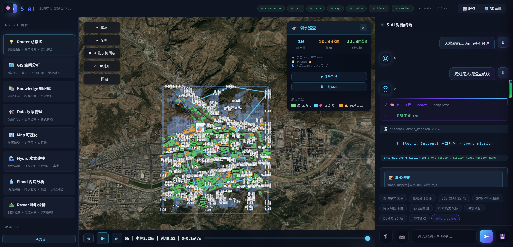

<p align="center">
  
  
  
  
  
  
</p>

<p align="center">
  <a href="https://guodaochong.github.io/s-ai/"><strong>🌐 项目主页 / Project Homepage</strong></a>
</p>


<h1 align="center">
  S-AI · 水利空间智能体平台
</h1>

<p align="center">
  <em>以自然语言为接口，以空间计算为引擎，以认知智能为灵魂——</em><br>
  <strong>S-AI</strong> 是一座架设于人类语言与地球表面之间的认知桥梁。<br>
  用一句话唤醒沉睡在地形数据中的智慧，让每一滴雨水的轨迹都清晰可辨。
</p>

---

## ◆ 理念 · 为什么需要 S-AI

传统空间信息系统的门槛高悬：用户需要理解坐标系、掌握工具参数、熟记操作流程。而真正的专家思维——"先看地形，再算汇流，然后评估淹没风险"——这种链式推理能力，被锁在 GIS 工程师的大脑里。

**S-AI 打破了这个壁垒。**

我们将 **大语言模型的推理能力**、**MCP 微服务协议的工具编排能力**、**Leaflet + Three.js 的空间可视化能力**编织成一个有机整体。这不是一个套了地图壳的聊天机器人——这是一个**真正理解"空间"的人工智能体**：它能从一句自然语言中推断出你需要什么工具、什么参数、什么顺序，并自主完成从 DEM 采样到三维渲染的全链路计算。

```
"查询纬度33.197经度104.893的高程和坡度"
  → GLM ReAct 推理 → Raster 服务 DEM 采样 → 结果渲染到对话 + 地图标注

"帮我做一个完整的流域分析"
  → 🌊 空间推演引擎 → AI自主编排: DEM分析→流域提取→河网提取→汇流计算→渲染出图

"赤峰从降雨预报到洪水淹没完整过程"
  → 🌊 空间推演引擎 → AI编排6步DAG: 降雨网格→设计暴雨→径流计算→3D洪水模拟→淹没范围→渲染
  → 每步结果实时渲染到地图，DAG进度条可视化

"这个区域如果发生百年一遇暴雨，哪里会被淹？"
  → 设计暴雨生成 → SCS-CN径流 → 洪水淹没 → 风险分区 → 3D水动力模拟

"展示赤峰未来三天降雨预报过程"
  → precipitation_grid → Open-Meteo ERA5-Land 9km网格 → 动画热力图 + 移动暴雨中心 + 面雨量过程线

"识别天水市中心的建筑"
  → building_extract → OpenStreetMap精确轮廓 + 类型分类(住宅/商业/工业) + 卫星影像叠加

"天水市暴雨24小时150mm会不会淹"
  → flood_sim_3d → SRTM DEM → OSM土地利用CN → SCS-CN产流 → 时间面积法汇流
  → Manning二维浅水演进 → 1174栋建筑逐栋淹没评估 → 流量过程线 + 深度热力图动画

"天水洪水无人机巡查航线"
  → drone_mission → 洪水风险热点识别 → TSP路径优化 → 3D飞行预览 → KML导出DJI

"水体监测陇南"
  → water_monitor → Sentinel-2 L2A 卫星下载 → NDWI水体提取 → 多边形 + 面积统计

"帮我重建这个水工建筑物的3D模型"
  → reconstruct_3d → 上传照片 → TripoSR AI重建 → Three.js GLB查看器
```

---

## ◆ 系统架构 · 全景

```
┌─────────────────────────────────────────────────────────────────────────────────┐
│                           🖥️ Vue 3 前端 (Port 5173)                             │
│                                                                                 │
│  ┌──────────┐  ┌──────────────────────────────┐  ┌───────────────────────────┐ │
│  │  SideBar  │  │       MapPanel               │  │     ChatPanel             │ │
│  │           │  │                               │  │                           │ │
│  │ · Agent   │  │  Leaflet (CartoDB Dark)       │  │  SSE 实时对话流            │ │
│  │   面板    │  │  Three.js 3D 地形渲染         │  │  思考框 (Spinner+进度)     │ │
│  │ · 对话    │  │  水动力 ShaderMaterial 模拟   │  │  工具状态 (⏳→✅ 实时)     │ │
│  │   历史    │  │  图层管理 (GeoJSON 叠加)      │  │  18+ 工具渲染策略          │ │
│  │ · 系统    │  │  水位控制 + 时间线播放器       │  │  导出 (GeoJSON/报告)      │ │
│  │   信息    │  │  示例图层 + 坐标拾取          │  │  Auto-pipeline 链式推理   │ │
│  │  推演DAG + 进度条         │ │
│  └──────────┘  └──────────────────────────────┘  └───────────────────────────┘ │
│                                                                                 │
│  ┌──────────────────────────────────────────────────────────────────────────┐   │
│  │                    WorkflowEditor (DAG 智能体编排)                        │   │
│  │   拖拽画布 · SVG Bezier 连线 · 节点状态机 · 模板系统 · 拓扑执行          │   │
│  └──────────────────────────────────────────────────────────────────────────┘   │
│                                                                                 │
│  Pinia Stores: chat.ts · map.ts · three.ts                                     │
│  Composables: useSSE.ts · useToolRenderer.ts · useServices.ts                  │
│  Build: Vite 8 (rolldown) · TypeScript · TailwindCSS v3                        │
└────────────────────────────────────┬────────────────────────────────────────────┘
                                     │ HTTP/SSE (Vite Proxy :5173 → :3000)
┌────────────────────────────────────▼────────────────────────────────────────────┐
│                    ⚡ FastAPI Orchestration Layer (Port 3000)                     │
│                                                                                  │
│  ┌──────────────────────────────────────────────────────────────────────────┐   │
│  │                       🧠 GLM-4 AIR 推理引擎                                │   │
│  │                                                                          │   │
│  │  ┌─────────────┐  ┌──────────────┐  ┌──────────────┐  ┌──────────────┐ │   │
│  │  │  三层路由     │  │  ReAct 推理   │  │  辩论验证     │  │  思维树      │ │   │
│  │  │  L1→L2→L3   │  │  8步链式调用  │  │  3角色共识    │  │  ToT 广度搜索│ │   │
│  │  └─────────────┘  └──────────────┘  └──────────────┘  └──────────────┘ │   │
│  │                                                                          │   │
│  │  ┌─────────────┐  ┌──────────────┐  ┌──────────────┐  ┌──────────────┐ │   │
│  │  │  自动工具生成 │  │  自修复引擎   │  │  常识注入     │  │  物理校验    │ │   │
│  │  │  LLM→Python  │  │  失败→修复    │  │  领域知识增强  │  │  水力学约束  │ │   │
│  │  └─────────────┘  └──────────────┘  └──────────────┘  └──────────────┘ │   │
│  └──────────────────────────────────────────────────────────────────────────┘   │
│                                                                                  │
│  ┌──────────────────────────────────────────────────────────────────────────┐   │
│  │                       🛡️ 可靠性基础设施                                   │   │
│  │                                                                          │   │
│  │  ┌──────────┐  ┌───────────┐  ┌───────────┐  ┌───────────┐  ┌─────────┐ │   │
│  │  │  熔断器   │  │  结果缓存  │  │  可观测追踪 │  │  自进化   │  │  记忆库  │ │   │
│  │  │  3次熔断  │  │  LRU 200  │  │  Trace Span│  │  路由学习 │  │  SQLite │ │   │
│  │  │  120s冷却 │  │  5min TTL │  │  全链路记录 │  │  精度统计 │  │  Episode│ │   │
│  │  └──────────┘  └───────────┘  └───────────┘  └───────────┘  └─────────┘ │   │
│  └──────────────────────────────────────────────────────────────────────────┘   │
│                                                                                  │
│  ┌──────────────────────────────────────────────────────────────────────────┐   │
│  │                       🔮 数字孪生桥梁                                     │   │
│  │                                                                          │   │
│  │  ┌───────────────┐  ┌────────────────┐  ┌────────────────────────────┐  │   │
│  │  │ DEM 数据源     │  │  气象预报 API   │  │  可扩展数据源注册表        │  │   │
│  │  │ 0.5m EPSG:4544│  │  Open-Meteo     │  │  file · api · stream      │  │   │
│  │  │ 22K×36K px    │  │  3天预报缓存    │  │  健康检查 + 自动发现       │  │   │
│  │  └───────────────┘  └────────────────┘  └────────────────────────────┘  │   │
│  └──────────────────────────────────────────────────────────────────────────┘   │
└────────────────────────────────────┬────────────────────────────────────────────┘
                                     │ MCP Protocol (HTTP/JSON)
     ┌───────────┬───────────┬───────┴───────┬───────────┬───────────┬───────────┐
     │           │           │               │           │           │           │
┌────▼────┐ ┌────▼────┐ ┌────▼────┐  ┌──────▼────┐ ┌────▼────┐ ┌────▼────┐ ┌────▼────┐
│ GIS     │ │ Data    │ │Knowl-   │  │ Map       │ │ Hydro   │ │ Flood   │ │ Raster  │
│ :5001   │ │ :5002   │ │ edge    │  │ :5004     │ │ :5005   │ │ :5006   │ │ :5007   │
│         │ │         │ │ :5003   │  │           │ │         │ │         │ │         │
│ 8 tools │ │5 tools  │ │4 tools  │  │ 4 tools   │ │5 tools  │ │5 tools  │ │5 tools  │
│         │ │         │ │         │  │           │ │         │ │         │ │         │
│ spatial │ │read_    │ │search   │  │render_map │ │design_  │ │flood_   │ │dem_     │
│ _query  │ │vector   │ │get_     │  │weather_   │ │storm    │ │inunda-  │ │analyze  │
│ buffer  │ │write_   │ │param    │  │forecast   │ │scs_cn   │ │tion_map │ │flow_    │
│ overlay │ │vector   │ │explain_ │  │satellite_ │ │swmm_    │ │flood_   │ │accumu-  │
│ coord_  │ │validate │ │concept  │  │search     │ │simulate │ │assess-  │ │lation   │
│ trans-  │ │         │ │get_     │  │spatial_   │ │cali-    │ │ment     │ │water-   │
│ form    │ │         │ │standard │  │knowledge  │ │brate    │ │drainage │ │shed_    │
│ geometry│ │         │ │         │  │           │ │         │ │flood_   │ │delineate│
│ _props  │ │         │ │         │  │           │ │         │ │warning  │ │terrain_ │
│ import_ │ │         │ │         │  │           │ │         │ │flood_   │ │profile  │
│ network │ │         │ │         │  │           │ │hydro-   │ │risk_zone│ │scatter_ │
│         │ │         │ │         │  │           │ │dynamic  │ │         │ │interp   │
│         │ │         │ │         │  │           │ │_2d_sim  │ │         │ │tin_gen  │
│         │ │         │ │         │  │           │ │         │ │         │ │quadtree │
└─────────┘ └─────────┘ └─────────┘  └───────────┘ └─────────┘ └─────────┘ └─────────┘
```

---

## ◆ 核心引擎 · 深度解析

### 1. 三层智能路由 (L1 → L2 → L3)

```
用户输入: "这个区域百年一遇暴雨会淹到哪里？"
     │
     ▼
┌─ L1: 关键词快速匹配 ──────────────────────────────────────────────┐
│  127+ 预置规则，覆盖高频水利查询                                     │
│  "暴雨" → hydro层 | "淹没" → flood层 | "高程" → raster层           │
│  命中率 ~70%，延迟 <1ms                                             │
└────────────────────────────┬────────────────────────────────────────┘
                             │ 未命中
                             ▼
┌─ L2: LLM 意图分类 ──────────────────────────────────────────────┐
│  LLM 推断意图 → 映射到 7 个服务域                           │
│  延迟 ~500ms，准确率 ~90%                                          │
└────────────────────────────┬────────────────────────────────────────┘
                             │ 置信度不足
                             ▼
┌─ L3: auto_tool 兜底 ────────────────────────────────────────────┐
│  LLM 直接生成 Python 工具代码 → 沙箱执行 → 结果渲染                  │
│  兜底一切无法归类的需求，零工具盲区                                   │
└──────────────────────────────────────────────────────────────────┘
```

### 2. ReAct 推理引擎

每个用户请求触发一个 ReAct (Reasoning + Acting) 循环，最多 8 步链式推理：

```
Step 1/8: 💭 分析用户请求...
          🎯 决定调用: dem_analyze({"lat":33.197,"lng":104.893})
          ✅ 结果: elevation=2847m, slope=32.5°

Step 2/8: 💭 结果分析...
          🎯 决定调用: flow_accumulation({"lat":33.197,"lng":104.893})
          ✅ 结果: flow_acc=1247, 流向=SE

Step 3/8: 💭 综合分析完成
          ✅ 推理完成，共3步，调用2个工具
```

每步可选 53 个工具中的任意组合，自动串联上下文（前一步的输出可作为下一步的输入）。

### 3. 辩论验证 (Debate Validation)

对于关键工具（洪水淹没、风险评估、SWMM 模拟、2D 水动力），结果必须通过**三角色辩论共识**：

| 角色 | 职责 | 评估维度 |
|------|------|---------|
| 🔬 物理验证专家 | 水力学规律一致性 | 流速范围、水深合理性 |
| 📊 数据合理性专家 | 数值范围校验 | 统计分布、异常值检测 |
| ✅ 任务完整性专家 | 需求覆盖度 | 是否完整回答用户问题 |

三个角色独立打分 (1-10)，至少 2 个通过 + 平均分 ≥ 6 → 共识通过。否则返回警告。

### 4. 自动工具生成 + 自修复

当现有 53 个工具无法满足需求时，触发 `auto_tool`：

```
用户: "帮我计算这个流域的重现期降雨强度"
  │
  ├─ 现有工具无匹配 → 触发 auto_tool
  ▼
LLM 生成 Python 代码 → 沙箱执行
  │
  ├─ 执行成功 → 返回结果
  └─ 执行失败 → 自修复引擎
       │
       ▼
  将 完整错误堆栈 + 原始代码 发送给 LLM
       │
       ▼
  LLM 生成修复代码 → 重新执行 (最多重试 2 次)
```

### 5. 思维树推理 (Tree-of-Thought)

面对复杂、模糊的请求，系统生成 3 条候选方案，每条独立评估打分，选择最优路径：

```
用户: "这个区域怎么防治山洪？"
  │
  ├─ 方案 A: 地形分析→汇流计算→工程建议 (score: 8)  ← 选中
  ├─ 方案 B: 历史灾情查询→风险分区→预警方案 (score: 7)
  └─ 方案 C: 气象预报→径流模拟→应急响应  (score: 6)
```

### 6. 物理常识注入 + 水力学校验

系统在推理前注入水利领域常识，增强 LLM 准确性：

```
"黄河流域年均降水量 300-800mm"
"曼宁糙率: 混凝土管 0.013, 土渠 0.025"
"SCS-CN: 混凝土 98, 草地 60-70, 林地 35-60"
"设计暴雨重现期: 城市排水 2-10年, 防洪 50-100年"
```

执行后还有**水力学物理校验**：流速 0-15 m/s、水深正值、坡度 0-90°。

### 7. 空间推演引擎 (Spatial Deduction Engine)

面对复杂分析需求，系统不再是逐步ReAct推理，而是**AI自主编排完整工具链**——从一句话生成可执行的DAG（有向无环图），逐步推演，实时可视化。

```
用户: "赤峰从降雨预报到洪水淹没完整过程"
      ↓
┌─ AI自主编排 ───────────────────────────────────────────────────┐
│                                                                │
│  GLM-4 AIR 收到：                                               │
│  · 18个pipeline工具目录 + 描述                                   │
│  · 用户原始query                                                │
│  · 领域编排规则                                                  │
│                                                                │
│  AI自主决定：                                                    │
│  ✅ 选哪些工具（从18个里动态选择）                                 │
│  ✅ 什么顺序（基于水文工程领域知识）                                │
│  ✅ pipeline名称 + emoji图标                                     │
│                                                                │
│  → 输出JSON工具链                                                │
└────────────────────────────┬───────────────────────────────────┘
                             ↓
┌─ 安全保障层（代码兜底，非AI） ──────────────────────────────────┐
│  · 工具名校验：必须在18个目录中                                    │
│  · 拓扑排序：径流必须在暴雨后，损失评估必须在模拟后                    │
│  · 首尾修正：降雨/地形排首位，渲染排末尾                             │
│  · 步数限制：3-6步                                                │
└────────────────────────────┬───────────────────────────────────┘
                             ↓
┌─ 逐步推演 + 实时可视化 ────────────────────────────────────────┐
│                                                                │
│  🌧️ 降雨分析 ──→ 🌧️ 设计暴雨 ──→ 💧 径流计算                    │
│     ✅ 完成        ✅ 完成         ✅ 完成                        │
│                       ↓                                         │
│  🌊 洪水模拟 ──→ 🗺️ 淹没范围 ──→ 🗺️ 渲染出图                    │
│     ✅ 完成        ✅ 完成         ✅ 完成                        │
│                                                                │
│  DAG节点逐步亮起 (⏳→🔄→✅)                                      │
│  进度条: 10% → 30% → 50% → 70% → 90% → 100%                    │
│  每步结果实时渲染到2D/3D地图场景                                   │
└────────────────────────────────────────────────────────────────┘
```

**不是预设模板，是AI实时编排。** 同一个系统，面对不同的分析需求，会生成完全不同的工具链。

### 8. 智能追问建议

每次分析完成后，系统基于已使用的工具，自动推荐最相关的后续操作：

```
用户完成降雨分析后:
  🔗 推荐下一步:
  [赤峰暴雨XXmm会不会淹]  [赤峰XX年一遇设计暴雨]  [赤峰天气预报查询]
       ↓ 点击填入输入框       ↓ XX自动选中          ↓ 直接查询
  用户输入150 → 回车发送     用户输入100 → 回车      触发weather_forecast
  → 触发flood_sim_3d        → 触发design_storm
```

27个工具的链式推荐映射，81条建议文本全部通过路由规则匹配验证，确保点击后100%触发正确工具。

---

## ◆ 可靠性基础设施

| 模块 | 实现 | 说明 |
|------|------|------|
| **熔断器** | 3 次失败触发，120s 冷却 | 防止故障雪崩 |
| **LRU 缓存** | 200 条容量，5min TTL | 相同参数直接返回 |
| **全链路追踪** | TraceSpan 记录路由/LLM/工具/渲染 | 可观测性 |
| **自进化路由** | 记录每次路由结果，统计准确率 | 自动学习高频模式 |
| **智能体记忆** | SQLite (episodes/facts/procedures) | 跨会话经验积累 |
| **数字孪生桥梁** | 可扩展数据源注册表 | DEM + 气象 + 自定义 |

---

## ◆ 前端 · Vue 3 架构

### 技术栈

| 层级 | 技术 | 职责 |
|------|------|------|
| **框架** | Vue 3.5 + TypeScript | Composition API，类型安全 |
| **构建** | Vite 8 (rolldown) | 亚秒级 HMR，生产级 tree-shaking |
| **状态** | Pinia (3 stores) | 消息流 / Leaflet 图层 / Three.js 场景 |
| **样式** | TailwindCSS v3 + CSS Variables | 暗色毛玻璃主题 |
| **地图** | Leaflet + CartoDB Dark | GeoJSON 叠加、图层管理、坐标拾取 |
| **3D** | Three.js r160 + OrbitControls | 海拔着色地形、天空穹顶 Shader |
| **水动力** | Three.js + GLSL ShaderMaterial | TIN 网格水面、顶点位移波浪、时间线播放器 |
| **通信** | EventSource (SSE) | 12 种事件类型实时推送 |
| **编排** | WorkflowEditor (DAG) | 拖拽画布、SVG Bezier 连线、模板系统 |

### 24+ 工具渲染策略

每种工具类型拥有独立渲染函数，返回 `{ html, mapActions[] }`：

| 策略 | 输出 |
|------|------|
| `dem_analyze` | SVG 仪表盘 + 高程/坡度卡片 |
| `buffer` / `overlay` | GeoJSON 地图叠加 + 可视化 |
| `design_storm` | SVG 时间序列降雨图表 |
| `flood_inundation` | GeoJSON 淹没范围 + 统计表 |
| `watershed_delineate` | 流域边界 + 河网叠加 |
| `flow_accumulation` | 汇流累积热力图 |
| `swmm_simulate` | SWMM 时间序列曲线 |
| `hydrodynamic_2d_sim` | Three.js 3D 水动力自动播放 |
| `scatter_interpolate` | 插值热力图 image overlay |
| `precipitation_grid` | **动画网格热力图 + 时间轴 + 移动暴雨中心 + 面雨量过程线** |
| `reconstruct_3d` | **TripoSR GLB 3D查看器 + 下载按钮** |
| `building_extract` | **OSM建筑轮廓 + 类型色阶 + 卫星影像叠加 + 统计面板** |
| `water_monitor` | **NDWI水体多边形 + 面积统计面板** |
| `flood_sim_3d` | **深度热力图网格 + 建筑淹没动画 + 流量过程线SVG + 流域参数面板** |
| `drone_mission` | **🚁无人机飞行预览 + 航点标记 + 轨迹尾迹 + KML下载** |
| Generic fallback | 表格 / 代码块 / JSON / SVG 图表 |

### SSE 事件流 (15 种类型)

```
start            → 会话初始化，获取 conv_id
thinking_start   → 创建思考框 (Spinner + Agent + Label)
thinking         → 添加思考行 (6 种样式分类)
thinking_end     → 关闭思考框 (✓ complete)
tool_start       → 工具开始 (⏳ running + 实时计时)
tool_end         → 工具结束 (✅ ok / ❌ error)
tool_result      → 工具结果 + 地图动作 + HTML 渲染
tool_error       → 工具错误信息
pipeline_start   → 推演引擎启动 (DAG节点列表)
pipeline_step    → 节点状态更新 (pending→running→done/error)
pipeline_done    → 推演完成 (总耗时+步数)
chain_suggestion → 智能追问建议 (工具链推荐)
divider          → 分隔线 (两侧渐变)
text             → LLM 文本回复
done             → 推理完成
```

---

## ◆ 能力矩阵 · 53 工具

### 🤖 AI 视觉与遥感 (6 tools)

| 工具 | 说明 |
|------|------|
| `reconstruct_3d` | **AI三维重建** — 单张照片→3D网格 (TripoSR, ~2.3GB VRAM, <1s推理) |
| `building_extract` | **建筑识别** — OSM精确轮廓优先 + SAM分割补充, 6类分类(住宅/商业/工业/公共/附属) |
| `water_monitor` | **遥感水体监测** — Sentinel-2 L2A 10m, NDWI水体提取, 免费无需API Key |
| `precipitation_grid` | **气象降水网格** — ERA5-Land 9km逐小时, 动画热力图+移动暴雨中心+逆地理编码 |
| `flood_sim_3d` | **分布式水文×二维水动力** — SRTM DEM+OSM土地利用CN+SCS-CN产流+时间面积法汇流+Manning二维演进 |
| `drone_mission` | **无人机航线规划** — 洪水风险热点→TSP路径优化→KML导出→DJI可执行 |
| `weather_forecast` | 气象预报 (温度/风速/湿度, Open-Meteo) |

### 🗺️ GIS 空间分析 (8 tools)

| 工具 | 说明 |
|------|------|
| `spatial_query` | 空间关系查询 (intersects/contains/within/...) |
| `buffer` | 几何缓冲区分析 |
| `overlay` | 叠加分析 (intersection/union/difference) |
| `coordinate_transform` | 坐标转换 (EPSG:4544 ↔ WGS84) |
| `geometry_properties` | 几何属性 (面积/周长/质心) |
| `read_vector` / `write_vector` | 矢量数据读写 |
| `validate_data` | 数据质量校验 |
| `import_network` | 管网数据导入 |

### 🏔️ Raster 地形分析 (5 tools)

| 工具 | 说明 |
|------|------|
| `dem_analyze` | DEM 高程/坡度/坡向采样 (0.5m分辨率, 无DEM时自动从API获取) |
| `flow_accumulation` | D8 流向 + 汇流累积 |
| `watershed_delineate` | Strahler 分级流域自动提取 |
| `terrain_profile` | 地形剖面线 |
| `scatter_interpolate` | 散点插值 (Kriging/IDW/RBF) |

### 💧 Hydro 水文建模 (5 tools)

| 工具 | 说明 |
|------|------|
| `design_storm` | 芝加哥设计暴雨 (任意重现期) |
| `runoff_compute` | SCS-CN 径流计算 |
| `swmm_simulate` | PySWMM 排水管网模拟 |
| `calibrate_suggest` | 模型率定建议 |
| `hydrodynamic_2d_sim` | **2D 水动力 TIN 网格模拟** (GLSL 实时渲染) |

### 🌊 Flood 内涝分析 (5 tools)

| 工具 | 说明 |
|------|------|
| `flood_inundation_map` | 洪水淹没范围 |
| `flood_assessment` | 洪水风险评估 |
| `drainage_assessment` | 排水能力校核 |
| `flood_warning` | 洪水预警等级 |
| `flood_risk_zones` | 洪水风险分区 |

### 📚 Knowledge + Data + Map (13 tools)

| 工具 | 服务 | 说明 |
|------|------|------|
| `get_parameter` | Knowledge | 曼宁糙率/SCS-CN/管材/水泵/海绵/排水参数 |
| `explain_concept` | Knowledge | 水利专业概念解释 |
| `search` | Knowledge | 知识库语义搜索 |
| `get_standard` | Knowledge | 水利标准规范 (GB50014等) |
| `render_map` | Map | 地图渲染 |
| `weather_forecast` | Map | 气象预报 (Open-Meteo) |
| `satellite_search` | Map | 卫星影像检索 |
| `spatial_knowledge_query` | Map | 空间知识图谱 |
| `auto_tool` | Internal | LLM 自动生成工具 (兜底) |
| `image_analysis` | Internal | 图片理解 (GLM-4V) |

---

## ◆ 智能体编排 · Workflow DAG



WorkflowEditor 提供可视化 DAG 编排能力：

- **拖拽式画布** — 7 个 Agent 工具面板，拖到画布即创建节点
- **SVG Bezier 连线** — 端口连接，数据流可视化
- **节点状态机** — idle → running → done/error，实时状态
- **预置模板** — 地形分析链、洪水分析链，一键加载
- **localStorage 持久化** — 保存/加载/删除
- **拓扑排序执行** — Run 按钮按依赖关系依次执行

---

## ◆ AI 视觉与遥感能力

### 🏗️ AI 三维重建 (TripoSR)



单张照片秒出3D网格模型，适用于水工建筑物、堤防、桥梁的3D数字化：

```
用户上传照片 → [img:dam.jpg]
  → TripoSR 2.3GB VRAM, ~1s 推理
  → GLB 网格导出 → Three.js 查看器
  → 可旋转/缩放/下载
```

### 🏙️ 建筑识别 (OSM + SAM)



双数据源建筑提取，优先使用OpenStreetMap精确轮廓：

| 数据源 | 准确率 | 速度 | 特点 |
|--------|--------|------|------|
| **OSM (优先)** | ~95%+ | ~8s | 精确轮廓 + 类型标签 + 楼层 |
| **SAM (补充)** | ~60% | ~70s | 卫星影像AI分割，OSM覆盖不足时使用 |

6类建筑分类：🏠 低层住宅 · 🏢 高层住宅 · 🏬 商业办公 · 🏭 工业仓储 · 🏫 公共设施 · 🔧 附属设施

### 🌊 遥感水体监测 (Sentinel-2)



自动下载Sentinel-2 L2A卫星影像（10m分辨率），计算NDWI提取水体：

```
STAC API搜索 → 云量过滤 → 覆盖检查
  → rasterio COG窗口读取 (B3 Green + B8 NIR)
  → NDWI = (Green - NIR) / (Green + NIR)
  → 形态学去噪 → 多边形提取 → GeoJSON输出
```

- **免费** — element84 STAC API + AWS S3公开数据，无需API Key
- **精确** — 10m分辨率，可识别小至50m²的水体
- **时序** — 支持多日期对比，监测河湖水库面积变化

### 🌧️ 气象降水网格 (ERA5-Land 9km)



逐小时降水网格动画，6级气象色阶，暴雨中心随时间轴移动：

```
Open-Meteo ERA5-Land API (0.1° ~9km)
  → N×N网格采样 → 坐标去重 → 面雨量过程线
  → Leaflet矩形热力图 → 时间轴播放器 (▶⏸⏮⏭)
  → 暴雨中心红点跟随移动 + Nominatim逆地理编码显示乡镇名
```

---

## ◆ 分布式水文 × 二维水动力淹没推演



这是S-AI最核心的AI能力——从一句自然语言出发，自主编排完整的 **降雨→产流→汇流→淹没→建筑评估** 全链路物理推演，13秒内给出科学可信的结果。

### 完整技术管线

```
用户: "天水市暴雨24小时150mm会不会淹"
  │
  ▼
┌─ ① 城市定位 ──────────────────────────────────────────────────┐
│  LLM传入 location="天水" → 46城内置坐标 / Nominatim在线地理编码    │
│  → bbox 生成 (±0.015°, ~3km²)                                    │
└──────────────────────────┬─────────────────────────────────────┘
                           ▼
┌─ ② SRTM全球DEM获取 ────────────────────────────────────────────┐
│  Terrarium SRTM 90m COG (AWS CloudFront, 免费无Key)              │
│  → rasterio窗口读取 → 106×66高程网格 (51m/px)                     │
│  → 三级fallback: Terrarium → Open-Meteo高程 → 合成地形              │
└──────────────────────────┬─────────────────────────────────────┘
                           ▼
┌─ ③ 流域划分 ──────────────────────────────────────────────────┐
│  D8流向算法: 每个网格8邻居最大坡降方向                              │
│  → Top-Down拓扑排序汇流累积 (BFS队列)                             │
│  → 河网提取 (facc > μ+3σ) → 汇流节点识别 (confluence detection)  │
│  输出: 367个河道网格, 15个流域节点                                 │
└──────────────────────────┬─────────────────────────────────────┘
                           ▼
┌─ ④ 分布式SCS-CN产流 ──────────────────────────────────────────┐
│  双源CN融合:                                                      │
│  ├─ OSM土地利用 (428个多边形): residential→85, commercial→92,    │
│  │  forest→55, farmland→75, water→98, highway→95               │
│  │  → matplotlib Path栅格化到DEM网格                              │
│  └─ 坡度fallback (OSM未覆盖区): <3°→82, 8-15°→72, >25°→58       │
│  CN范围: 55-98 (城市建成区精确识别)                                │
│  → SCS-CN公式: excess = (P-Ia)² / (P+0.8S), S=25400/CN-254     │
│  → 逐网格产流深度 (空间分布)                                       │
└──────────────────────────┬─────────────────────────────────────┘
                           ▼
┌─ ⑤ 时间-面积法汇流演算 ───────────────────────────────────────┐
│  行进时间计算: 沿D8流径累积 t = Σ(distance / velocity)            │
│  velocity = (1/n) · R^(2/3) · S^(1/2)  (Manning公式)             │
│  → 时间-面积直方图 (30bins, 按到出口距离分桶)                      │
│  → 降雨过程 × 直方图 → 出口流量过程 Q(t)                          │
│  输出: 峰值流量 59.5 m³/s @ 2.5h, 流量过程线时序                   │
└──────────────────────────┬─────────────────────────────────────┘
                           ▼
┌─ ⑥ 二维浅水方程淹没演进 ──────────────────────────────────────┐
│  每个时间步 (dt=15min, 共25步):                                   │
│  a. 分布式降雨入流: depth[r,c] += excess_grid × rain_factor × dt│
│  b. 河道流量注入: 节点Q(t)注入河道网格 (30%权重)                   │
│  c. Manning 8邻居扩散:                                            │
│     v = (1/n) · h^(2/3) · S^(1/2)                               │
│     q = v · h · cell_size / 8                                    │
│     水量守恒: depth[r,c] -= Σout, depth[nr,nc] += Σin           │
│  → 13帧深度网格时序输出                                            │
│  输出: 峰值水深 3.12m, 56.9%区域淹没                              │
└──────────────────────────┬─────────────────────────────────────┘
                           ▼
┌─ ⑦ 建筑逐栋淹没评估 ──────────────────────────────────────────┐
│  OSM建筑footprint → DEM高程采样 → 峰值水深采样                    │
│  → 每栋建筑: 安全 / 部分淹没 / 完全淹没                            │
│  → 淹没楼层估算 + 最大水深                                         │
│  输出: 1174栋建筑 — ✅669安全 / ⚠️505部分淹没 / ❌0完全淹没        │
└──────────────────────────┬─────────────────────────────────────┘
                           ▼
┌─ ⑧ 可视化输出 ────────────────────────────────────────────────┐
│  聊天卡片: 流量过程线SVG + 流域参数 + 峰值统计                     │
│  地图动画: 深度热力图网格 + 建筑彩色多边形 + 时间轴播放             │
│  统计面板: 峰值Q/水深/淹没面积/CN分布/河网密度/行进时间             │
└────────────────────────────────────────────────────────────────┘
```

### 关键技术指标

| 指标 | 数值 | 说明 |
|------|------|------|
| 全链路耗时 | **13-18秒** | 含DEM下载+OSM查询+物理模拟 |
| DEM分辨率 | 90m (SRTM) | 全球覆盖，免费 |
| CN网格精度 | 55-98 (OSM) | 土地利用驱动，城区精确 |
| 流量过程 | 25步时序 | 时间-面积法 + Manning汇流 |
| 二维演进 | 13帧深度网格 | 浅水方程逐网格扩散 |
| 建筑评估 | 逐栋精确 | 1174栋OSM建筑×峰值水深 |
| 数据源 | 全部免费 | SRTM+OSM+Open-Meteo, 零API费用 |

---

## ◆ 无人机自主航线规划



当洪水推演完成后，AI自动识别风险热点，为无人机巡查生成最优航线——**从数字孪生的输出，跃升到现实世界的行动指令**。

### 自主编排流程

```
洪水推演结果 → 风险热点识别 → 航点生成 → TSP路径优化 → 3D飞行预览 → KML导出
```

1. **AI自动选航点** — 从1174栋建筑中聚类出6个淹没密集区 + 4个深水区，共10个高风险航点
2. **TSP路径优化** — 最近邻初始化 + 2-opt局部搜索，总航程10.93km
3. **多任务模式** — 洪水巡查(80m蛇形) / 堤坝巡检(50m线性) / 搜救搜索(40m螺旋) / 灾后评估(120m网格)
4. **会话耦合** — 5分钟内自动复用洪水推演结果，无需重跑（bbox重叠检测）
5. **DJI导出** — 一键下载KML文件，直接导入DJI Pilot执行真实飞行任务

### 3D飞行预览

前端🚁无人机图标沿航线实时飞行，带轨迹尾迹，到达高风险航点时弹出风险详情。支持播放/暂停/航点跳转。

---

## ◆ 水动力 3D 可视化

2D 水动力模拟结果通过自定义 GLSL Shader 在 Three.js 中实时渲染：

```
TIN 三角网格 (tin_vertex_lng/lat/elev + tin_simplices)
  │
  ├─ 顶点位置 = DEM 高程 + 水深偏移
  ├─ 顶点颜色 = 深度渐变 (深蓝→浅蓝→白色泡沫)
  ▼
ShaderMaterial (GLSL)
  ├─ 顶点着色器: sin/cos 波浪位移
  └─ 片元着色器: 深度着色 + 菲涅尔反射 + 泡沫
  ▼
时间线播放器: ▶Play ⏸Pause | Seek拖动 | 1x/2x/4x变速 | 自动播放
```

---

## ◆ 快速体验 · 核心命令

打开聊天框，输入以下命令即可触发对应AI能力：

| 命令 | 触发能力 | 效果 |
|------|---------|------|
| `赤峰从降雨预报到洪水淹没完整过程` | 🌊 空间推演引擎 | AI自主编排6步DAG: 降雨→暴雨→径流→3D洪水→淹没→渲染 |
| `模拟赤峰暴雨洪水全过程` | 🌊 空间推演引擎 | AI编排: DEM→设计暴雨→径流→洪水模拟→损失评估 |
| `识别天水市中心的建筑物` | 🏙️ OSM建筑提取 | 卫星影像 + 建筑轮廓 + 6类分类(住宅/商业/工业) |
| `展示赤峰市未来三天预报降雨过程` | 🌧️ ERA5-Land降水网格 | 动画热力图 + 移动暴雨中心 + 村庄级逆地理编码 |
| `识别天水的水体` | 🌊 Sentinel-2 NDWI | 卫星下载 + 水体多边形 + 面积统计 |
| `天水市暴雨24小时150mm会不会淹` | 🌊 分布式水文×二维水动力 | SRTM DEM→SCS-CN产流→汇流→淹没演进→建筑评估 |
| `天水洪水无人机巡查航线` | 🚁 无人机航线规划 | 洪水热点→TSP优化→3D飞行预览→KML导出DJI |

> 💡 所有命令均支持任意城市名（46城内置 + Nominatim在线地理编码），无需手动指定坐标。

---

## ◆ 快速启动

### 环境要求

- Python 3.10+
- Node.js 18+
- `ZHIPUAI_API_KEY` 环境变量

### 启动

```bash
# 1. API Key
set ZHIPUAI_API_KEY=your_key_here          # Windows
export ZHIPUAI_API_KEY=your_key_here       # Linux/Mac

# 2. Python 依赖
pip install fastapi uvicorn httpx zhipuai rasterio geopandas shapely \
            numpy scipy fiona pyswmm structlog python-dotenv \
            segment-anything torch torchvision pillow opencv-python pyproj

# 3. 一键启动全部服务 (7 MCP + Web Server)
python start_all.py
# → Web  :3000  GIS  :5001  Data :5002  Knowledge :5003
# → Map  :5004  Hydro:5005  Flood:5006  Raster    :5007

# 4. 启动前端
cd web/frontend
npm install && npm run dev
# → Vite :5173  (代理 /api/* → :3000)
```

### 生产构建

```bash
cd web/frontend && npm run build    # → dist/ (~836KB JS, 236KB gzip)
```

---

## ◆ 项目结构

```
S-AI/
├── web/
│   ├── server.py                    # 后端入口 (~55行, create_app factory)
│   ├── app/                         # 后端核心模块 (重构自2600行单体)
│   │   ├── config.py                # GLM_TOOLS(53), TOOL_TO_SERVER, ROUTING_RULES
│   │   ├── streaming.py             # SSE chat endpoint + ReAct推理循环 + pipeline集成
│   │   ├── pipeline.py              # 🌊 空间推演引擎 (AI自主编排DAG)
│   │   ├── dispatcher.py            # 12个内部工具handler
│   │   ├── router.py                # 三层路由 L1→L2→L3
│   │   ├── services.py              # 8个领域服务 (flood_sim_3d, building_extract...)
│   │   ├── knowledge.py             # 知识图谱 + 天气/降水/卫星API
│   │   ├── llm.py                   # GLM-4 AIR 异步客户端
│   │   ├── utils.py                 # compress_result, trim_context(16K), SSE
│   │   ├── store.py                 # MemoryStore + ConversationStore (SQLite WAL)
│   │   ├── validators.py            # 物理校验 + 三角色辩论验证
│   │   ├── multimodal.py            # GLM-4V 图像分析
│   │   ├── auth.py                  # API Key中间件 (timing-safe)
│   │   ├── mcp_client.py            # MCP SSE客户端 (缓存+熔断器)
│   │   ├── tracing.py               # TraceSpan + 路由演化追踪
│   │   ├── routes/                  # REST API routers
│   │   │   ├── system.py            # health, servers, heightmap
│   │   │   ├── files.py             # upload, image analysis
│   │   │   ├── data.py              # memory, weather, satellite, kg
│   │   │   ├── tracing.py           # traces, evolution stats
│   │   │   ├── reconstruct.py       # 3D reconstruction
│   │   │   └── conversations.py     # 会话历史 CRUD
│   │   └── tools/                   # LLM代码生成沙箱
│   │       ├── sandbox.py           # AST安全检查 + subprocess执行
│   │       ├── _sandbox_runner.py   # restricted builtins + import白名单
│   │       └── generator.py         # LLM代码生成 + 质量检查 + 自修复
│   │
│   ├── reconstruct/                 # AI 3D重建模块 (TripoSR)
│   ├── segment/                     # AI 建筑提取模块 (OSM + SAM)
│   ├── water_monitor/               # 遥感水体监测模块 (Sentinel-2)
│   ├── flood_sim/                   # 分布式水文×二维水动力模块
│   ├── drone/                       # 无人机航线规划模块
│   └── frontend/                    # Vue 3 前端
│       └── src/
│           ├── components/          # TopBar SideBar MapPanel ChatPanel
│           │                        # ReconstructionPanel WorkflowEditor
│           ├── stores/              # chat.ts map.ts three.ts
│           ├── composables/         # useSSE useToolRenderer useServices
│           └── types/               # SSEEvent ChatMessage ToolResult
│
├── servers/                         # 7个MCP微服务
│   ├── mcp-gis/                     # Port 5001: 空间查询/缓冲区/叠加/坐标转换
│   ├── mcp-data/                    # Port 5002: 数据导入/空间查询
│   ├── mcp-knowledge/               # Port 5003: 参数查询/语义搜索
│   ├── mcp-map/                     # Port 5004: 地图渲染/专题图
│   ├── mcp-hydro/                   # Port 5005: 设计暴雨/径流/SWMM
│   ├── mcp-flood/                   # Port 5006: 洪水淹没/评估/风险
│   └── mcp-raster/                  # Port 5007: DEM分析/流域/汇流
│
├── sai/                             # 分布式Agent系统 (Redis + EventBus)
├── start_all.py                     # 一键启动 7 MCP + Web
├── data/                            # DEM, SQLite, 生成工具
├── .env                             # ZHIPUAI_API_KEY
└── README.md
```

---

## ◆ 设计决策 · Why

### 为什么选择 MCP 微服务

每个空间领域拥有完全不同的计算范式和依赖链。MCP 拆分带来：**故障隔离**（GIS 崩溃不影响水文模拟）、**独立扩展**（DEM 计算可单独部署）、**工具热插拔**（新增工具无需重启主服务）、**熔断保护**（单工具故障不拖垮推理链）。

### 为什么用 ReAct 而非 Function Calling

Function Calling 一次只能选一个工具。水利分析天然是多步推理：先看地形、再算汇流、然后评估风险。ReAct 循环允许 LLM 每步观察上一步结果，动态调整策略，形成真正的推理链。

### 为什么用 ShaderMaterial 做水动力

MeshPhysicalMaterial 无法实现实时水面波动。自定义 GLSL Shader（顶点位移 + 深度着色 + 菲涅尔反射 + 泡沫效果）实现 TIN 网格实时可视化，每帧更新顶点位置和颜色。

### 为什么选择 Vue 3

前端管理复杂的实时状态流（SSE 12 种事件、思考过程、工具状态、GeoJSON 渲染）。Vue 3 Composition API + Pinia 提供最直观的响应式状态管理，TypeScript 类型推导让 SSE→UI 整条数据链路清晰可追踪。

---

## ◆ License

MIT License — 自由使用，欢迎贡献。

---

<p align="center">
  <sub>由 <strong>LUOBIN-PI Research Lab</strong> 倾力打造</sub><br>
  <sub>让空间智能，触手可及</sub>
</p>
